# Hi there, I'm Vandana Devi Pampana 👋

### Full-Stack & MERN Developer | Computer Science Student

<picture>
  <source media="(prefers-color-scheme: dark)" srcset="./dark.svg">
  <source media="(prefers-color-scheme: light)" srcset="./light.svg">
  
</picture>

---

## 🚀 About Me

I am a passionate Computer Science student focused on building practical web applications, exploring data science, and developing software solutions.

- 🛠️ **Tech Focus:** MERN Stack Development, Java, Python, Operating Systems, Data Mining & DBMS
- 🎓 **Education:** Pursuing Computer Science Engineering
- 💻 **Projects:** Online Event Ticketing System, Fake News Detection, Inventory & Sales Management
- 📬 **GitHub:** [@VANDANADEVIPAMPANA](https://github.com/VANDANADEVIPAMPANA)

---

## ⚡ Skills & Technologies

| Category | Technologies |
| :--- | :--- |
| **Languages** | Java, Python, JavaScript, HTML5, CSS3, C |
| **Web Development** | MongoDB, Express.js, React.js, Node.js (MERN) |
| **Data & Analytics** | Data Mining, Jupyter Notebook, Pandas |
| **Core CS** | DBMS, Operating Systems, Advanced Data Structures (ADS) |
| **Tools & Platforms** | Git, GitHub, VS Code |

---

## 📁 Key Repositories & Projects

### 🎟️ Online Event Ticketing System
- **Tech Stack:** JavaScript, HTML, CSS, Node.js
- **Description:** Web application for browsing events and booking tickets online seamlessly.

### 📰 Fake News Detection Project
- **Tech Stack:** Python, Machine Learning, Jupyter Notebook
- **Description:** Machine learning model to identify and classify false news articles.

### 📊 Inventory and Sales Management System
- **Tech Stack:** Java, Database Management System
- **Description:** Application to track inventory, record sales, and manage stock efficiently.

### 🌐 MERN Stack Lab & Labs
- **Repos:** `mernstack-lab`, `java-lab-`, `Data-Mining-Lab`
- **Description:** Collection of lab exercises, algorithms, and practical implementations.

---

## 📬 Let's Connect

Whether you want to collaborate on a project or discuss technology, feel free to reach out!

- **GitHub Profile:** [VANDANADEVIPAMPANA](https://github.com/VANDANADEVIPAMPANA)

---

  Built with code & curiosity © 2026 Vandana Devi Pampana

